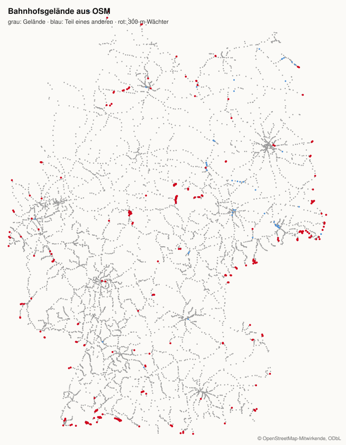

# 48 — Bahnhofsumrisse: wo ein Bahnhof anfängt

Recherche und Plan zu Issue #64, 29. September 2026. Johannes' Auftrag: „Let's first write a
prototype description how this could look like! Maybe we get the polygon outline of a
trainstation from OSM? Or from the Bahn Open Data stuff?"

**Entschieden (Johannes, 29. September):**

- **OSM unter ODbL ist in Ordnung.** Veröffentlichung der Umrisse und Namensnennung werden geplant
  (unten).
- **Keine Anfrage an DB InfraGO**; offene DB-Daten ja, wenn sie etwas hergeben.
- **„Am Bahnhof" heißt: irgendwo auf dem Gelände.** Läden, Halle, Vorplatz, Wege gehören dazu.
- **Erst zählen, wie weit wir kommen.** Wo es keinen Umriss gibt, bleibt der 300-m-Kreis die
  Grenze.

## Was heute gilt

Ein Bahnhof ist für die App ein **Punkt** — die Koordinate, die unsere Tabelle aus dem Feed
übernimmt (docs/44). Darum liegt ein fester Kreis von 300 m, der die App weckt
(`Geofence.swift`, `GeofenceManager.kt`, docs/25). Was danach passiert, ist auf den beiden
Plattformen verschieden:

**iOS: die 50-m-Schwelle.** Beim Betreten des 300-m-Kreises (`didEnterRegion`) schaltet die App
das GPS ein — laufende Standortmeldungen mit 10 m Genauigkeit, auch im Hintergrund
(`beginNearWatch`). Es wird nicht geschlafen und nachgesehen: Jede Meldung, die iOS liefert, wird
sofort geprüft (`didUpdateLocations`, Fall `.dwell`). Die Beobachtung endet beim ersten dieser
vier Ereignisse:

| Ereignis | Folge |
|---|---|
| ein Fix liegt höchstens 50 m vom Bahnhofspunkt | Nudge in 45 s, GPS aus |
| ein Fix liegt außerhalb der 300 m | kein Nudge, GPS aus („left before getting close") |
| iOS meldet das Verlassen des 300-m-Kreises (`didExitRegion`) | kein Nudge, GPS aus, ein geplanter Nudge wird zurückgenommen |
| sechs Minuten vergangen (`nearWatchWindow`) | kein Nudge, GPS aus |

**Android: keine 50-m-Schwelle.** Der Kreis ist als Geofence mit *Dwell* registriert: Wer drei
Minuten im 300-m-Kreis bleibt, bekommt nach einem einzigen Kontroll-Fix (ebenfalls „innerhalb
300 m") den Nudge (`onStationDwell`). Android prüft also schon heute nur den 300-m-Kreis — genau
das, was als Rückfall ohne Umriss gewollt ist.

Die 50 m sind die Schwachstelle: Sie messen den Abstand zu einem Punkt, nicht, ob man auf dem
Gelände steht.

## Gemessen

### Zehn Bahnhöfe gegen die 50 m (Overpass, 29. September)

Zug-Bahnsteige aus OSM (`railway=platform` im Umkreis von 450 m, ohne Tram-, Bus- und
U-Bahn-Steige) gegen den Punkt unserer Tabelle:

| Bahnhof | weitester Bahnsteigpunkt | Anteil der Bahnsteige innerhalb 50 m |
|---|---|---|
| München Hbf | 688 m | 0 % |
| Hamburg Hbf | 468 m | 8 % |
| Stuttgart, Hauptbahnhof (oben) | 355 m | 0 % |
| Rheine, Bahnhof | 281 m | 0 % |
| Kißlegg Bahnhof | 191 m | 36 % |
| Hagen Hbf | 178 m | 0 % |
| Langenargen Bahnhof | 166 m | 53 % |
| Leichlingen Bf | 138 m | 17 % |

In München, Stuttgart, Rheine und Hagen liegt **kein einziger Bahnsteigpunkt** innerhalb der 50 m.
Wer dort am Gleis wartet, bekommt auf dem iPhone keinen Nudge, außer er geht am Punkt vorbei. Und
München reicht 688 m weit: weiter, als der 300-m-Kreis wacht.

### Stufe 1, die Steige aus unseren Feeds: gezählt, reicht nicht

Der Import liest jede Zeile von `stops.txt`, auch jeden Steig mit Koordinate. Gezählt über den
ganzen DELFI-Feed (550.000 Zeilen) gegen unsere 7.632 Bahnhöfe, deutsche Bahnhöfe allein (die
übrigen sind polnische und andere Auslandsbahnhöfe ohne deutsche DHID):

| Rang | Bahnhöfe | mit ≥ 3 Steigpunkten |
|---|---|---|
| 3, Fernverkehr | 308 | 240 (78 %) |
| 2, Regional | rund 5.070 | 3.287 (65 %) |
| 1, nur S-Bahn | rund 830 | 590 (71 %) |

Die Abdeckung wäre ordentlich, **die Form ist es nicht**: Köln Hbf hat 11 Steigpunkte auf 104 m,
die echten Bahnsteige messen rund 410 m. Hamburg Hbf hat 3 Punkte auf 87 m. Umgekehrt zieht die
DHID in kleinen Orten Bushaltestellen mit hinein (Langenargen: 252 m Spanne gegen 98 m
Bahnsteig), und einzelne Gruppen sind kaputt (eine reicht 260 km weit). Die Feed-Steige sind
Haltepunkte für die Fahrplanauskunft, keine Vermessung. **Stufe 1 fällt weg.**

### DB Open Data: OpenStation, keine Umrisse

DB InfraGO veröffentlicht **OpenStation**, einen NeTEx-Datensatz aller Personenbahnhöfe, frei
herunterladbar über die Mobilithek
(https://mobilithek.info/offers/879076212433727488, Doku https://github.com/dbinfrago/openstation-docs).
Geladen und ausgezählt (Stand 29. September, 304 MB): 5.393 Bahnhöfe, 21.784 Bahnsteigkanten,
5.346 Zugangsbereiche, 1.761 Eingänge — und **kein einziges Polygon**. Koordinaten tragen nur
2.485 Ausstattungsorte (Aufzüge, Rolltreppen); Bahnhöfe und Steige haben keine. Reich an
Beschreibung (Adresse, Barrierefreiheit, Ausstattung), aber ohne Geometrie. Das Streckennetz von
DB InfraGO (WFS, CC BY 4.0) führt Bahnhöfe als Punkte; sein Endpunkt antwortete am 29. September
mit 404.

Für die Umrisse bleibt **OpenStreetMap**. OpenStation bleibt als Quelle für Aufzüge und
Barrierefreiheit interessant — ein eigenes Thema.

### Stufe 2, OSM: gezählt für Nordrhein-Westfalen

Aus dem Geofabrik-Auszug NRW (914 MB) mit `osmium tags-filter` die Bahnhofs-Objekte gezogen
(7 MB) und für jeden unserer 782 Bahnhöfe in NRW ein **Gelände** gebildet:

1. **Anker:** der nächste OSM-Bahnhof (`railway=station`/`halt`, ohne U-, Stadt- und
   Museumsbahn) höchstens 400 m von unserem Punkt.
2. **Glieder:** Zug-Bahnsteige, Empfangsgebäude (`building=train_station`) und Bahnhofsflächen
   (`public_transport=station`) höchstens 500 m vom Anker, die diesem Anker näher sind als jedem
   anderen Bahnhof.
3. **Gelände:** die konvexe Hülle der Glieder, 20 m gepuffert. Die Hülle schließt ein, was
   zwischen Gebäude und Gleisen liegt — Halle, Läden, Wege, Vorplatz — und das ist gewollt.

| Rang | Bahnhöfe | mit Gelände | Rückfall 300 m | Gelände reicht weiter als 300 m |
|---|---|---|---|---|
| 3 | 46 | 44 (95 %) | 2 | 43 % |
| 2 | 567 | 554 (97 %) | 13 | 5 % |
| 1 | 169 | 164 (97 %) | 5 | 9 % |

Beispiele: Köln Hbf 6 Bahnsteige, 10 ha, reicht 358 m weit; Düsseldorf Hbf 15 Bahnsteige, 23 ha,
467 m; Dortmund Hbf 10 Bahnsteige, 15 ha, 587 m; Leichlingen 1 Bahnsteig, 0,2 ha, 137 m.

**Fallstrick:** Köln Messe/Deutz ist in OSM zwei Bahnhöfe, „hoch" und „tief". Die
Nächster-Anker-Regel gibt unserem einen Bahnhof nur die Bahnsteige des einen. Die Zuordnung muss
mehrere OSM-Bahnhöfe gleichen Namens zu einem von uns zusammenlegen können.

NRW ist dicht gemappt; im ländlichen Osten und Süden kann die Quote niedriger liegen. Die Zählung
für ganz Deutschland steht im nächsten Abschnitt.

### Probelauf ganz Deutschland (29. September)

`stellwerk --staging stations outlines --dry-run --from germany-latest.osm.pbf` — die Stationen
mit ihren echten Ids vom Server, der Geofabrik-Auszug Deutschland (4,8 GB) in Rust gelesen, kein
`osmium`. 2 Minuten 13 Sekunden, 570 MB Speicher. Aus dem Auszug: 6.786 OSM-Bahnhöfe, 19.368
Bahnsteige und Gebäude.

| Rang | Stationen in Deutschland | mit Gelände | Teil eines anderen | 300-m-Wächter |
|---|---|---|---|---|
| 3, Fernverkehr | 316 | 297 (94 %) | – | 19 |
| 2, Regional | 5.165 | 4.897 (95 %) | 47 | 221 |
| 1, nur S-Bahn | 1.010 | 935 (93 %) | 11 | 64 |

Die übrigen 1.141 Stationen der Tabelle liegen im Ausland (kein OSM-Bahnhof in 5 km, also außerhalb
des Auszugs); unter den „300-m-Wächtern" stecken zudem Schweizer und österreichische Grenzhalte,
die näher als 5 km an einem deutschen Bahnhof liegen. Verworfen wurde eine einzige Station
(Offenbach Ost, 61 ha — die Grenze liegt bei 50).

- **Ringe:** im Fernverkehr Median 328 m, 90 % unter 438 m, größter 621 m; zwei Drittel sind
  größer als die heutigen 300 m. Im Regional- und S-Bahn-Verkehr fast überall 300 m.
- **Tastpunkte:** 4.813 von 6.129 Geländen haben genau einen; große Bahnhöfe drei bis sechs
  (Köln Hbf 3, München Hbf 4, Frankfurt Hbf 5, Stuttgart 6).
- **iOS-Plätze am Bahnhof** (Regenschirm + Ring + Tastpunkte + Ringe der Nachbarn): nirgends
  mehr als 20; am meisten braucht Niebüll mit 10.
- **Zwei Fehler, die der Lauf gefunden hat:** OSM taggt die S-Bahn in Hamburg und Berlin als
  `station=light_rail` — das anfängliche Filter hielt sie für Straßenbahnen (Rang 1 stieg nach der
  Korrektur von 74 % auf 93 %). Und der Rang durfte über die Nähe entscheiden, wenn die Namen
  nicht passten: Düsseldorf-Sonnenstraße sammelte die Anker von Volksgarten und Friedrichstadt ein.
  Jetzt entscheidet der Rang nur zwischen gleichnamigen Stationen (Frankfurt Hbf und „tief"),
  sonst die nächste.
- **Teil eines anderen Geländes** (58) sind vor allem Doppeleinträge unserer Tabelle
  („Hamburg, Altona" → „Hamburg-Altona", „Niebüll neg" → „Niebüll") und Straßenbahn-Halte neben
  einem Bahnhof („Kassel Scheidemannplatz" → „Kassel Hauptbahnhof").

Die 30 Zeichnungen und die Deutschlandkarte liegen in [`docs/assets/48/`](assets/48/), der
Bericht in [`probelauf-bericht.txt`](assets/48/probelauf-bericht.txt): zehn große Bahnhöfe, zehn
regionale quer durch die Größen, die zehn kleinsten. Grau die Bahnsteige, schwarz das Gelände,
rot die Tastpunkte, gestrichelt der Ring, der rote Punkt ist unser Punkt aus dem Feed. In Triangel
liegt er gut 300 m neben dem Bahnsteig — der Ring sitzt jetzt auf dem Gelände.

## Der Plan

### Im Import

Einmal pro Stationsimport (in Produktion, wie die Ids — docs/46):

1. Geofabrik-Auszug Deutschland laden (rund 4,4 GB), mit `osmium tags-filter` auf Bahnhöfe,
   Bahnsteige, Empfangsgebäude und Bahnhofsflächen reduzieren (erwartet unter 50 MB). Kein
   Overpass: Der öffentliche Server lieferte schon beim Prototypen über Minuten nur Timeouts.
2. Pro Bahnhof das Gelände wie oben, mit der Zusammenlegung gleichnamiger OSM-Bahnhöfe.
3. Vereinfachen auf höchstens 24 Ecken; Plausibilität: Fläche unter 50 ha, unser Punkt höchstens
   400 m entfernt, sonst verworfen und im Importbericht genannt.

Neue, **eigene Tabelle** `station_outlines` (nicht Spalten in `stations`, siehe Lizenz):

| Feld | Inhalt |
|---|---|
| `station_id` | unser Bahnhof |
| `outline` | das Gelände als Polygon, WGS84, ≤ 24 Ecken (für die Veröffentlichung und die Entwicklungsseite) |
| `ring_lat`, `ring_lon`, `ring_radius_m` | **Bahnhofsring**: Mitte des Geländes, Radius bis zum äußersten Punkt des Geländes + 100 m, mindestens 300 m, höchstens 1.000 m |
| `touch` | **Tastpunkte**: bis zu 6 Kreise (`lat`, `lon`, `r`), jeder mindestens 120 m, die das Gelände zusammen abdecken |
| `osm_ids`, `osm_timestamp` | woraus und aus welchem Stand es gebaut ist |

Ring und Tastpunkte rechnet der **Server** beim Import aus: gleiche Kreise auf iOS und Android, im
Import prüfbar, und der native Code bleibt ohne Geometrie.

## Auf dem Telefon: die einfache Fassung

Entschieden mit Johannes, 29. September: **nur Geofences, kein GPS.** Keine Wache, kein
Kontroll-Fix, keine Wartezeit. Das ist bewusst die einfachste Fassung, die wir auf echten Fahrten
testen; was sie nicht kann, sagt der Test, nicht eine Vermutung.

### Außerhalb eines Bahnhofs: wie heute

Regenschirm, Abdeckungsscheibe, das Neuzeichnen beim Verlassen des Regenschirms, häufige und
nächste Bahnhöfe — alles bleibt. Zwei Stellen ändern sich:

- Jeder Bahnhof wird mit seinem **Bahnhofsring** registriert statt mit 300 m um den Feed-Punkt.
  (München: Der Feed-Punkt liegt 292 m neben den Bahnsteigen, der 300-m-Kreis bewacht die falsche
  Stelle.)
- Der Regenschirm zieht beim nächsten *nicht* bewachten Bahnhof dessen **Ringradius** ab statt
  pauschal 300 m (`umbrellaRadius`, `Geofence.swift`). Sonst wäre er bei großen Ringen bis zu
  700 m zu groß, und man könnte an einem unbewachten Bahnhof stehen.

### Einen Bahnhof betreten

1. **Ring betreten** → die App merkt sich „am Bahnhof X" (gespeichert, übersteht Neustart und
   App-Öffnen).
2. Sie registriert die **Tastpunkte** von X. Die Plätze nimmt sie den unwichtigsten fernen
   Bahnhöfen weg; **Regenschirm, der Ring von X und die Ringe der Nachbarn** (deren Ring den von X
   berührt) bleiben. Sie fragt jeden Tastpunkt sofort `requestState` — wer beim Anmelden schon
   drin ist, bekommt sonst kein Ereignis.
3. **Ein Tastpunkt meldet „drin"** → **Nudge sofort.** Wer im Zug sitzt, ist eingecheckt (kein
   Nudge) oder tippt „Später" (docs/24 §3). Die üblichen Regeln bleiben: keine Fahrt offen, kein
   Ruhe-Fenster, kein Cooldown, nicht stummgeschaltet; ein Nudge pro Aufenthalt.

### Einen Bahnhof verlassen

1. **Ring verlassen** → Tastpunkte ab, der normale Satz wird mit dem heutigen Code neu gezeichnet,
   „am Bahnhof" ist vorbei.
2. Der Ring bleibt die ganze Zeit **registriert und wird nicht angefasst**: iOS verliert kein
   Verlassen einer Region, die registriert bleibt; es meldet es womöglich spät (rund 200 m hinter
   der Grenze, 20 s), aber es meldet es. Gefährlich war nur das Neu-Registrieren nach dem
   Verlassen — für eine Region, außerhalb derer man beim Anmelden schon ist, kommt kein Verlassen.
3. **Netz darunter:** Jeder Weg, der heute alle Regionen neu setzt (`configure` beim Öffnen der
   App, `refreshNearest`, der Berechtigungswechsel), geht durch **eine** Funktion, die „am Bahnhof"
   kennt und den Ring stehen lässt. Und nach **90 Minuten** oder bei einer Standortmeldung
   außerhalb des Rings ist „am Bahnhof" ebenfalls vorbei — jeder dieser Ausgänge steht im
   Protokoll.

### Ohne Gelände

Ein Bahnhof ohne Gelände (3 % in NRW) hat als Ring die 300 m um seinen Punkt und **keinen**
Tastpunkt: Das Betreten des Rings ist dann selbst der Nudge. Das ist der 300-m-Wächter.

### Was wegfällt

- Die GPS-Wache nach dem Betreten (`beginNearWatch`, sechs Minuten, 50-m-Schwelle) — samt dem
  Fehler, dass nach ihrem Ablauf bis zum nächsten Betreten nichts mehr kommt.
- Die 45 Sekunden bis zum Nudge und auf Android die drei Minuten Dwell.

### Android

Android erlaubt 100 Geofences statt 20. Es registriert deshalb zu jedem Bahnhof im Satz **Ring
und Tastpunkte dauerhaft**, ohne Tauschen und ohne Zustand: Tastpunkt `ENTER` (mit
`INITIAL_TRIGGER_ENTER`) → Nudge. Bahnhöfe ohne Gelände: Ring `ENTER` → Nudge. Google nennt eine
Latenz von meist unter zwei, nach langem Stillstand bis zu sechs Minuten.

### Umsetzungsregeln (aus der zweiten Kritik, 29. September)

Die einfache Fassung bleibt, wie sie ist; diese Regeln sorgen dafür, dass der heutige Code sie
nicht untergräbt und der Test verwertbare Zahlen liefert.

**iOS**

- **Eine Funktion setzt Regionen** (`applySet`): Sie vergleicht mit `monitoredRegions` und rührt
  Ring und Tastpunkte eines Bahnhofs, an dem man ist, nie an. Heute rufen sieben Wege
  `stopAllRegions`/`registerStations` auf, und `registerStations` meldet jeden Ring neu an
  (`startMonitoring` + `requestState`, `Geofence.swift:926`) — das ist genau das Neu-Registrieren,
  bei dem ein Verlassen verloren geht. Alle sieben gehen durch `applySet`: `configure` (:736,
  :756), sein Timeout (:786), der Konfigurations-Fix (:1140), `refreshNearest` (:1245, :1259), der
  Berechtigungswechsel (:1034), `stop` (:885).
- **Beim Öffnen der App** fragt `configure` den bestehenden Ring mit `requestState`; „draußen"
  beendet den Aufenthalt — ein kostenloser Abgleich.
- **Der Aufenthalt speichert den ganzen Bahnhof** (Id, Name, Ring, Tastpunkte). Heute findet
  `didExitRegion` den Bahnhof nur in der aktuellen Liste (`station(for:)`, :983); fällt er bei
  einer Aktualisierung heraus, wird sein Verlassen verworfen.
- **Bis zu zwei Bahnhöfe gleichzeitig** (Köln Hbf und Messe/Deutz): der Aufenthalt ist eine
  Zuordnung Bahnhof → Tastpunkte. 2 × 6 Tastpunkte + 2 Ringe + Regenschirm = 15 von 20. Ein
  Ring-Verlassen nimmt nur die eigenen Tastpunkte; neu gezeichnet wird erst, wenn keiner mehr offen
  ist.
- **Ring-Verlassen beendet den Aufenthalt und sonst nichts.** Heute löscht es Cooldown und
  offenen Nudge (`cancelNudge`, :1096–1099) — das passte zur Wartezeit; mit sofortigem Nudge gäbe
  ein Flattern am Ringrand einen zweiten. Cooldown und das 10-Minuten-Fenster bleiben.
- **Während einer Fahrt** tauscht das Betreten eines Rings keine Tastpunkte ein.
- **Sofort heißt `trigger: nil`**, nicht eine Wartezeit von 0 — die lässt
  `UNTimeIntervalNotificationTrigger` nicht zu. `nudgeDelayS` fällt aus `configure`.
- Der Tausch beim Ring-Betreten läuft in `beginBackgroundTask` (das Aufwecken gibt nur Sekunden).
- **Jeder Zustand ins Protokoll**, auch `.unknown` und `.outside` von `requestState` — heute wird
  alles außer `.inside` still verworfen (:1054), und „nie gefeuert" sähe aus wie „unbekannt".

**Android**

- **Grenze 100:** 20 Bahnhöfe × (Ring + 6 Tastpunkte) wären 141 — `addGeofences` scheitert dann
  ganz. Bahnhöfe mit Gelände bekommen **nur Tastpunkte**, ohne Gelände nur den Ring; insgesamt
  höchstens 99 plus Regenschirm, die nächsten Bahnhöfe zuerst.
- Der Kontroll-Fix „innerhalb 300 m vom Feed-Punkt" (`onStationDwell`, `GeofenceManager.kt:289`)
  fällt weg — er unterdrückt genau den Münchner Fall.
- `ENTER` für Tastpunkt-Ids (`touch:X:n`) statt `DWELL` für `station:` (`GeofenceReceiver.kt:35`);
  das 10-Minuten-Fenster über alle Bahnhöfe wie auf iOS.

**Beide**

- **Kein Nudge und kein Zählen im Vordergrund.** Heute zählt ein Nudge als „ignoriert", auch wenn
  die App offen war und ihn verschluckt hat (`Geofence.swift:1355`).
- **Ein „drin" beim Anmelden** (`requestState`, Android `INITIAL_TRIGGER_ENTER`) beginnt nur dann
  einen neuen Aufenthalt, wenn vorher ein Verlassen gesehen wurde. Sonst nudgt jedes App-Öffnen und
  jeder Neustart die Leute, die neben einem Bahnhof wohnen, und nach drei Mal ist ihr Bahnhof
  30 Tage stumm (docs/25 §4).
- **Test-Telefone:** Ein Schalter „Stummschalten aus" auf der Entwicklungsseite, damit der Test
  nicht still abreißt, und jedes Stummschalten im Protokoll.

**Import**

- **Jeder OSM-Anker gehört genau einem unserer Bahnhöfe.** Frankfurt (Main) Hauptbahnhof und
  „… tief" sind bei uns zwei Einträge unter einem Gelände; der zweite bekommt keine eigenen
  Tastpunkte, sondern gilt als Teil des ersten. Der Importbericht nennt jeden solchen Fall.

**Was der Test braucht**

- Zu jedem Ereignis die Position, die das System ohnehin hat — iOS `manager.location` mit Alter und
  Genauigkeit, Android `triggeringLocation` —, ohne GPS einzuschalten.
- Ein Knopf „Jetzt auf dem Gelände" auf der Entwicklungsseite: der Zeitpunkt, an dem man es
  wirklich war. Erst damit lassen sich die Zahlen 1 und 3 messen, und „spät" von „falscher Ort"
  trennen.

### Die Daten fürs Telefon

**Entschieden (Johannes, 29. September): eine eigene Datei.**

Eine **zweite Datei** neben dem Bahnhofsauszug (docs/45): `bahnhofsumrisse.bin`, nach unseren Ids,
mit Ring, Tastpunkten und Gelände. Nicht aus Kompatibilitätsgründen — wir sind nicht live —,
sondern wegen der Lizenz: So ist die ODbL-Datenbank eine eigene Datei, getrennt von den Namen und
Ids aus DELFI (unten). Ohne diese Datei (älterer Server, Download fehlgeschlagen) gilt für alle
Bahnhöfe der 300-m-Wächter.

### Was der Test zeigen muss

Die Entwicklungsseite zeichnet Ring, Tastpunkte und Gelände, und das Protokoll nennt jeden
Schritt mit Zeit: „Ring Köln Hbf betreten", „Tastpunkt 3 drin", „Nudge", „Ring verlassen
(nach 14 min)". Auf Probefahrten zählen vier Zahlen:

1. **Wie lange** vom Betreten des Geländes bis zum Nudge (iOS liefert einen 120-m-Kreis wann?).
2. **Wie oft** ein Tastpunkt an einem kleinen Halt gar nicht feuert (dort ist der Kreis kaum
   größer als das Gelände).
3. **Wie oft** ein Nudge neben dem Bahnhof kommt statt darauf.
4. **Wie spät** das Verlassen des Rings kommt, und ob einer der Notausgänge je gebraucht wird.

Erst diese Zahlen entscheiden, ob etwas dazukommt (eine kurze GPS-Wache, ein Kontroll-Fix, eine
Wartezeit). Vorher nicht.

## Veröffentlichung und Namensnennung

### Was die ODbL verlangt (Einschätzung, keine Rechtsberatung)

- Die Gelände-Tabelle ist aus OSM **abgeleitet** und wird **öffentlich genutzt** (sie steckt in
  jeder App). Also: Namensnennung, und die abgeleitete Tabelle muss unter ODbL **angeboten**
  werden (ODbL 4.3, 4.4, 4.6).
- Share-Alike gilt für die **Gelände-Tabelle**, nicht für die App, nicht für die Stationsnamen
  und Ids aus DELFI und nicht für den Rest der Datenbank. Darum eine eigene Tabelle und eine eigene
  Datei fürs Telefon (`bahnhofsumrisse.bin`): Sie ist mit unseren übrigen Daten *zusammengestellt* (Collective Database),
  nicht mit ihnen *vermengt*. Die Umrisse nie in die Spalten von `stations` schreiben.
- Die OSM Foundation beschreibt das in den Community Guidelines, u. a. „Collective Database" und
  „Produced Work": https://osmfoundation.org/wiki/Licence/Community_Guidelines, Attribution:
  https://osmfoundation.org/wiki/Licence/Attribution_Guidelines.

### Was wir veröffentlichen

- **Die Datei:** `https://verspaetomat.de/daten/bahnhofsumrisse.geojson` — pro Bahnhof unsere Id,
  der Name, das Polygon, die OSM-Ids, der OSM-Stand. Lizenz ODbL 1.0, im Kopf der Datei genannt.
  Erwartete Größe um 4 MB (das Gelände als Polygon, Ring und Tastpunkte als Mittelpunkt und Radius;
  die Probelauf-GeoJSON mit gezeichneten Kreisen hat 19 MB). Die Website erzeugt sie beim Bauen aus der Tabelle (`site/`), neu nach
  jedem Stationsimport.
- **Der Weg dorthin:** Der Import-Code wird mit dem Repo öffentlich, bevor die App erscheint; die
  Datei nennt den Commit, der sie gebaut hat. Das erfüllt 4.6 doppelt.
- **Eine Seite dazu:** `verspaetomat.de/daten` — was die Datei ist, woher sie kommt, Lizenz,
  Stand, und ein Satz: Wer einen Umriss falsch findet, verbessert ihn am besten in OSM; der
  nächste Import übernimmt es.

### Wo die Namensnennung steht

| Ort | Text |
|---|---|
| App, „Woher kommen die Daten?" (Einstellungen) | „Bahnhofsgelände: © OpenStreetMap-Mitwirkende, ODbL" mit Link auf openstreetmap.org/copyright |
| App, Entwicklungsseite, wo das Gelände gezeichnet wird | „Gelände © OpenStreetMap-Mitwirkende" unter der Zeichnung |
| Website, Seite `daten` und Fußzeile | wie oben |
| `bahnhofsumrisse.geojson` | Lizenz und Quelle im Kopf |
| `bahnhofsumrisse.bin` fürs Telefon | Quelle und Lizenz im Kopf der Datei |

Die Texte in `app/lib/content/legal.dart` (Datenherkunft) und `docs/13` werden ergänzt; wie immer
gilt: kein Satz, den die Implementierung nicht hält.

## Reihenfolge

1. ✅ Prototyp als `stellwerk stations outlines --dry-run` (29. September, oben): ganz Deutschland,
   Zählung pro Rang, eine Deutschlandkarte statt einer Tabelle je Bundesland, die Verworfenen und
   30 Zeichnungen in `docs/assets/48`.
2. ✅ Tabelle `station_outlines` (Migration 0043), `POST /admin/stations/outlines` (ganz oder gar
   nicht, Prüfung jeder Zeile, unter 80 % nur mit `--force`) und `stellwerk stations outlines`.
   In Produktion seit 29. September (ab7c5f2): 6.129 Gelände, OSM-Stand 29. September; mit
   `deploy/stations-to-staging.sh` auf Staging.
3. `bahnhofsumrisse.bin` und die Seite `verspaetomat.de/daten` mit Namensnennung.
4. iOS: Ringe, Tastpunkte, „am Bahnhof", die eine Registrierungsfunktion, die Notausgänge;
   Android: Ringe und Tastpunkte dauerhaft. Entwicklungsseite und Protokoll.
5. Staging-Build, Probefahrten: München Hbf, Köln Hbf, ein ländlicher Halt; die vier Zahlen.
